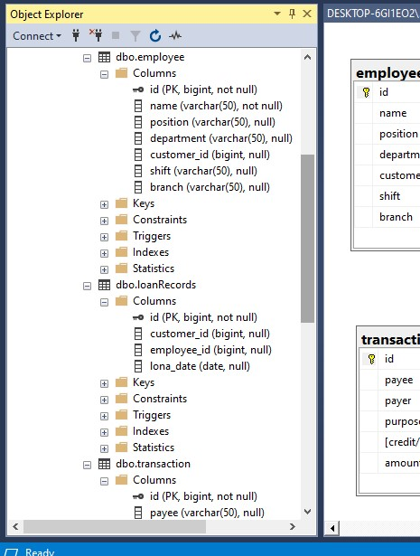
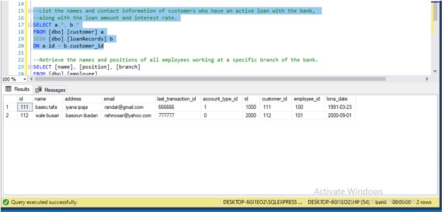

# bankDB_Create

## LOAN BANK DATABASE 

Hello everyone. This project was number 2 question in my mid semester exams in conestoga college canada. The question goes like this:
Create a database for a bank that focus mainly on loan dispensation. Your database should be able to answer the following queries.

Technology used:
- Draw.io: To model my tables 
- SQL Server Management Studio Management Studio 19: for creating the database and queries

This repository contains the SQL scripts and documentation for creating a relational database for a loan bank. The database consists of several tables to manage accounts, employees, customers, loan records, and transactions.

- Table of Contents
- Overview
- Database Schema
- Table Descriptions
- Installation
- Usage
- Sample Queries
- Contributing

## Overview
This database is designed to support the operations of a loan bank, tracking account information, employee details, customer data, loan records, and transaction history. It is implemented in SQL and can be used with various database management systems.

**Database Schema**
The database schema includes the following tables:

**Account**: Stores information about customer accounts.
- Employee: Contains details about bank employees.
- Customer: Manages customer information.
- LoanRecords: Tracks records of loans granted.
- Transactions: Records all transactions related to accounts.

  **Table Descriptions**
  
**Account**
| Column         | Data Type   | Description                            |
| -------------- | ----------- | -------------------------------------- |
| account_id     | VARCHAR(50) | Primary key for the account.            |
| customer_id    | BIGINT      | Foreign key referencing Customer table.|
| employee_id    | BIGINT      | ID of employee associated with the account.|
| balance        | MONEY       | Current account balance.                |
| account_type   | VARCHAR(50) | Type of account opened.    

**Employee**

| Column         | Data Type   | Description                                |
| -------------- | ----------- | ------------------------------------------ |
| employee_id    | BIGINT      | Primary key for the employee.               |
| employee_name  | VARCHAR(50) | Name of the employee.                       |
| position       | VARCHAR(50) | Job position/title.                         |
| department     | VARCHAR     | Position of the employee.                   |
| shift          | VARCHAR     | Shift the employee works.                   |
| branch         | VARCHAR     | Branch of the bank where the employee works.|

**Customer**
| Column            | Data Type   | Description                                       |
| ----------------- | ----------- | ------------------------------------------------- |
| customer_id       | INT         | Primary key for the customer.                      |
| customer_name     | VARCHAR(50) | Name of the customer.                             |
| address           | VARCHAR(100)| Customer's address.                               |
| email             | VARCHAR(50) | Email address of the customer.                     |
| last_transaction_id | BIGINT     | ID of the last transaction performed by customer. |
| account_type_id   | BIGINT      | ID indicating the account type (savings-0 or current-1).|

**LoanRecords**
| Column            | Data Type   | Description                                  |
| ----------------- | ----------- | -------------------------------------------- |
| loan_id           | INT         | Primary key for the loan record.             |
| customer_id       | INT         | Foreign key referencing Customer table.     |
| employee_id       | BIGINT      | ID of employee that granted the loan.        |
| loan_date         | DATE        | Date when the loan was approved.             |

**Transaction**
| Column | Data Type | Description |
| --- | --- | --- |
| transaction\_id | BIGINT | Primary key for the transaction. |
| account\_id | INT | Foreign key referencing Account table. |
| transaction\_type | VARCHAR(20) | Type of transaction (e.g., deposit, withdrawal). |
| amount | DECIMAL(10,2) | Amount involved in the transaction. |
| transaction\_date | DATETIME | Date and time of the transaction. |

**Installation**
- Clone this repository.
- Execute the SQL scripts provided in the sql_scripts directory to create the database and tables.
- Modify the database connection parameters in the scripts if needed.

**Usage**

The database is now ready for use. Ensure you have a compatible database management system installed, and update your application or SQL queries to interact with the tables as needed.

Sample Queries
Below are some sample SQL queries that demonstrate how to retrieve information from the database:

--Retrieve the account number, account type, and current balance for all active customer accounts.

    SELECT [id],[account_type], [balance]
    FROM [dbo].[account];
    

 

--Find the transaction details (transaction type, amount, date) for a specific account number for the last month, ordered by date in descending order

    SELECT a.*, b.[id]
    FROM [dbo].[transaction] a
    JOIN [dbo].[account] b
    ON a.id =b.transaction_id
    WHERE b.id = 'account_001'
    ORDER BY b.id DESC;
 

--List the names and contact information of customers who have an active loan with the bank, along with the loan amount and interest rate.

    SELECT a.*, b.*
    FROM [dbo].[customer] a
    JOIN [dbo].[loanRecords] b
    ON a.id = b.customer_id

 

--Retrieve the names and positions of all employees working at a specific branch of the bank.

    SELECT [name], [position], [branch]
      FROM [dbo].[employee]
      WHERE [branch] = 'bodija'
 

--Calculate the total number of accounts in the bank and the average account balance across all account types.

    SELECT COUNT([id]) AS 'Total number of account', AVG([balance]) AS 'Average balance'
      FROM [dbo].[account]

**Note**
This project was one of 2 projects and 40 MCQ  questions done in two and half hours. Ofcourse there are some columns i should have added.

**Contributing**
If you find any issues or have improvements to suggest, please feel free to open an issue or create a pull request.
